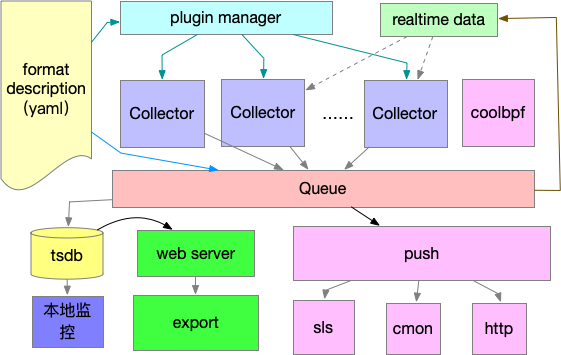
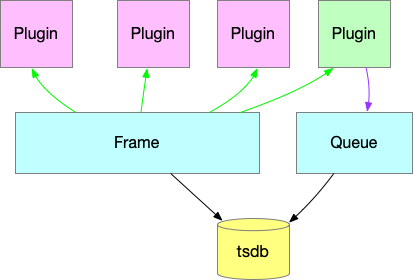

# 1、unity 监控框架概述

unity 监控框架以插件化开发为主，支持coolbpf 应用，以及多种数据发布方式。具有配置灵活，资源占用率低等优点，适合在服务器监控等领域部署。



# 2、开发构建流程

## 2.1 clone 代码

开发机可以访问gitee和registry.cn-hangzhou.aliyuncs.com，并且已经安装了docker 和 git。

```
git clone -b unity https://gitee.com/anolis/sysak.git
```

## 2.2 拉起容器

```
docker run -v /root/1ext/code/:/root/code -v /:/mnt/host:ro -v /var/run/docker.sock:/var/run/docker.sock --net=host --name unity --privileged  -itd registry.cn-hangzhou.aliyuncs.com/sysom/sysom:v1.0 /bin/sh
```

docker 参数说明：

* /root/1ext/code/:/root/code  -> 将代码目录挂载到容器目录下，方便代码同步
* /:/mnt/host:ro/:/mnt/host:ro  ->将host根目录的以只读方式挂载进来
* /var/run/docker.sock:/var/run/docker.sock -> 挂载host 侧的docker 接口，可以根据自己开发机的实际情况进行选择
* --name unity  docker 名，可以自定义命名
* --privileged 特权容器模式，如果要在容器里面进行调试，该选项不能省略

启动编译

```
./configure --enable-libbpf --enable-target-unity
 make
```

编译后在 sysak/out/.sysak_components/tools/dist 目录下会生成目标包文件。

## 2.3 准备 plugin.yaml 配置文件

unity 监控启动脚本默认会从 /etc/sysak/plugin.yaml 读取配置。典型的配置表说明：

```
config:
  freq: 20   # 采集间隔
  port: 8400  # 监听端口
  bind_addr: 0.0.0.0 # 监听ip
  backlog: 32  # 服务监听对队列长度，
  identity:   # 实例id配置模式，当前支持以下五种模式
  		    #	 hostip: 获取主机IP
  		    #	curl: 通过网络请求获取，需要指定url 参数，适合ECS场景
  		    #	file: 从文件读取，需要指定path 参数	
  		    # specify:	指定id，需要指定name参数
    mode: specify
    name: test_specify
  real_timestamps: true #上报监测数据的真实时间，默认关闭
  unix_socket: "/tmp/sysom_unity.sock" #通过unix_socket方式进行数据传输，默认关闭
  proc_path: /mnt/host/  # proc 文件路径，在host侧，为 / 在容器侧，如配置 -v /:/mnt/host 则配置为 /mnt/host
  
outline:   # 外部数据入口，适合接入外部数据场景
  - /tmp/sysom    # 外部unix socket 路径，可以指定多个

luaPlugins: ["proc_buddyinfo", "proc_diskstats", "proc_meminfo", "proc_mounts", "proc_netdev",
            "proc_snmp_stat", "proc_sockstat", "proc_stat", "proc_statm", "proc_vmstat"]  # 控制lua 插件加载
            

plugins:    # 插件列表 对应 /collector/plugin 路径下编译出来的c库文件。
  - so: kmsg   # 库名
    description: "collect dmesg info."  # 描述符
    ……

metrics:   # export 导出的 metrics 列表
  -
    title: sysak_proc_cpu_total  # 显示的表名
    from: cpu_total     # 数据源头，对应collector生成的数据表
    head: mode   # 字段名，在prometheus 中以label 方式呈现
    help: "cpu usage info for total."   # help 说明
    type: "gauge"   # 数据类型
    ……
```

## 2.4 启动监控

进入 sysak/out/.sysak_components/tools/dist/app/beeQ 目录下， 执行run.sh 脚本，启动监控
执行 curl 即可以查询到实时数据

```
curl 127.0.0.1:8400/metrics
```

# 3、监控开发

## 3.1、监控指标采集 by lua

本节将描述讲解如何基于lua 开发proc 数据采集。

### 3.1.1、纯pystring 处理方法

预备知识，lua 

* [pystring](https://gitee.com/chuyansz/sysak/blob/opensource_branch/source/tools/monitor/unity/beaver/guide/pystring.md) 库，处理字符串
* [面向对象设计](https://gitee.com/chuyansz/sysak/blob/opensource_branch/source/tools/monitor/unity/beaver/guide/oop.md)

以提取 /proc/net/sockstat 数据为例，原始的信息如下：

```
#cat /proc/net/sockstat
sockets: used 83
TCP: inuse 6 orphan 0 tw 0 alloc 33 mem 2
UDP: inuse 6 mem 12
UDPLITE: inuse 0
RAW: inuse 0
FRAG: inuse 0 memory 0
```

#### 3.1.1.1、数据处理策略
sockstat 接口导出的数据非常有规律，基本上是

```
[大标题]: [小标题] [值] ……
[大标题]: [小标题] [值] ……
```

这种方法进行组合，可以针对以上方式进行处理。

#### 3.1.1.2、数据格式

监控使用 [protobuf](https://www.jianshu.com/p/a24c88c0526a) 来序列化和存取数据，标准数据.proto 文件描述如下：

```
	message labels {
                required string name   = 1;
                required string index  = 2;
                }
            message values {
                required string name   = 1;
                required double value  = 2;
                }
            message logs {
                required string name   = 1;
                required string log    = 2;
                }
            message  dataLine{
                required string line = 1;
                repeated labels  ls  = 2;
                repeated values  vs  = 3;
                repeated logs   log  = 4;
                }
            message  dataLines{
                repeated dataLine  lines = 1;
                }
           }
```

想了解监控 对 protobuf的处理，可以参考 [这个通用库](https://gitee.com/chuyansz/sysak/blob/opensource_branch/source/tools/monitor/unity/common/protoData.lua) 

#### 3.1.1.3、 vproc 虚基础类
vproc 是所有 proc 接口数据采集的基础类，提供了通用的数据封装函数。根据前面的proto 文件描述，存储数据实质就是一堆数据表行组成的，在[vproc](https://gitee.com/chuyansz/sysak/blob/opensource_branch/source/tools/monitor/unity/collector/vproc.lua) 声明如下：

```
function CvProc:_packProto(head, labels, vs, log)
    return {line = head, ls = labels, vs = vs, log = log}
end
```

添加数据行：

```
function CvProc:appendLine(line)
    table.insert(self._lines["lines"], line)
end
```

将生成好的数据往外部table 中推送并清空本地数据：

```
function CvProc:push(lines)
    for _, v in ipairs(self._lines["lines"]) do
        table.insert(lines["lines"], v)
    end
    self._lines = nil
    return lines
end
```

#### 3.1.1.4、整体代码实现
了解了vproc 类后，就可以从vproc 实现一个 /proc/net/sockstat 数据采集接口。代码 实现和注释如下：

```
require("class")  -- 面向对象 class 声明
local pystring = require("common.pystring")
local CvProc = require("collector.vproc")

local CprocSockStat = class("procsockstat", CvProc)  -- 从vproc 继承

function CprocSockStat:_init_(proto, pffi, pFile)   -- 调用构造函数
    CvProc._init_(self, proto, pffi, pFile or "/proc/net/sockstat")
end

function CprocSockStat:proc(elapsed, lines)   -- 在主循环中会周期性调用proc 函数进行收集数据
    CvProc.proc(self)   -- 新建本地表
    local vs = {}    -- 用于暂存有效数据
    for line in io.lines(self.pFile) do    -- 读取文件内容
        local cells = pystring:split(line, ":", 1)   -- 按: 分割标题和内容
        if #cells > 1 then   -- 防止 空行产生无效数据
            local head, body = cells[1], cells[2]
            head = string.lower(head)  -- 标题统一小写
            body = pystring:lstrip(body, " ")   -- 去除开头的空格
            local bodies = pystring:split(body, " ")   -- 按空格分割内容
            local len = #bodies / 2
            for i = 1, len do
                local title = string.format("%s_%s", head, bodies[2 * i - 1])    -- 组合数值标题
                local v = {
                    name=title,  
                    value=tonumber(bodies[2 * i])
                }
                table.insert(vs, v)  -- 添加到暂存表中
            end
        end
    end
    self:appendLine(self:_packProto("sock_stat", nil, vs))  -- 保存到本地表中
    return self:push(lines)   --推送到全局表，并发送出去
end

return CprocSockStat   -- 这一行不能少
```

#### 3.1.1.5、注册到主循环中

[loop.lua](https://gitee.com/chuyansz/sysak/blob/opensource_branch/source/tools/monitor/unity/collector/loop.lua) 是周期性采样所有数据的循环实现。首先将文件引入：

```
local CprocSockStat = require("collector.proc_sockstat")
```

然后添加到collector 表中

```
CprocSockStat.new(self._proto, procffi),
```

此时数据已经保存在本地

#### 3.1.1.6、导出到export

要将采集到的指标采集到export，只需要在 [plugin.yaml](https://gitee.com/chuyansz/sysak/blob/opensource_branch/source/tools/monitor/unity/collector/plugin.yaml) 中添加以下行做配置即可：

```
  - title: sysak_sock_stat
    from: sock_stat   # 代码中声明的表行
    head: value
    help: "sock stat counters from /proc/net/sockstat"
    type: "gauge"
```

#### 3.1.1.7、 数据呈现
用浏览器打开本地8400端口，到指标链接中，就可以提取到以下新增数据

```
# HELP sysak_sock_stat sock stat counters.
# TYPE sysak_sock_stat gauge
sysak_sock_stat{value="frag_inuse",instance="12345abdc"} 0.0
sysak_sock_stat{value="udplite_inuse",instance="12345abdc"} 0.0
sysak_sock_stat{value="udp_mem",instance="12345abdc"} 8.0
sysak_sock_stat{value="tcp_mem",instance="12345abdc"} 1.0
sysak_sock_stat{value="tcp_alloc",instance="12345abdc"} 32.0
sysak_sock_stat{value="frag_memory",instance="12345abdc"} 0.0
sysak_sock_stat{value="sockets_used",instance="12345abdc"} 80.0
sysak_sock_stat{value="raw_inuse",instance="12345abdc"} 0.0
sysak_sock_stat{value="tcp_tw",instance="12345abdc"} 0.0
sysak_sock_stat{value="tcp_orphan",instance="12345abdc"} 0.0
sysak_sock_stat{value="tcp_inuse",instance="12345abdc"} 5.0
```

### 3.1.2、FFI 处理方式
关于lua ffi 说明，可以先参考[lua扩展ffi](https://luajit.org/ext_ffi.html)，本质是lua 可以通过ffi 接口直接调用C库参数，无需经过中间栈上传参等操作。

ffi的注意点：

* ffi 数组下标是从0开始，和lua下标从1开始不一样；
* 可以直接引用ffi 中的数据结构，效率要比原生lua 高很多；
* ffi 是luajit 的功能，原生lua 并不支持；

#### 3.1.2.1、 为什么要使用ffi？
pystring 虽然可以高效处理字符串数据，但是相比c语言中的scanf 接口来说效率还是要低很多。因此按行读取proc 数据，可以采用 ffi 接口来显著提升数据处理效率

#### 3.1.2.2、 ffi 数据结构和api 说明

proc 数据以变参为主，下面的结构体主要用于scanf 获取变参， 用于上层数据处理

```
#define VAR_INDEX_MAX 64

// 变参整数类型，用于收集纯整数类型的数据
typedef struct var_long {
    int no;    // 收集到参数数量
    long long value[VAR_INDEX_MAX];   //参数列表
}var_long_t;

// 变参字符串类型
typedef struct var_string {
    int no; // 收集到参数数量
    char s[VAR_INDEX_MAX][32];   //参数列表
}var_string_t;

// 变参 k vs 类型
typedef struct var_kvs {  
    int no;  // 收集到参数数量
    char s[32];   // 标题
    long long value[VAR_INDEX_MAX];   // 参数列表
}var_kvs_t;
```

导出的c api

```
int var_input_long(const char * line, struct var_long *p);
int var_input_string(const char * line, struct var_string *p);
int var_input_kvs(const char * line, struct var_kvs *p);
```

综合来说：

* var\_long\_t 适合纯整数数字输出的场景
* var\_string\_t 适合纯字符串输出的场景
* var\_kvs\_t 适合单字符串 + 多整形数字 组合的场景，如 /proc/stat的内容输出

其它重复组合场景可以先按照 var\_string\_t 来收集，然后对指定位置的数字字符串通过tonumber 进行转换。

#### 3.1.2.3 实际应用例子
以[kvProc.lua](https://gitee.com/chuyansz/sysak/blob/opensource_branch/source/tools/monitor/unity/collector/kvProc.lua) 为例，它实现了一个通用kv组合的proc接口数据的数据高效的处理方法。如经常使用到的 /proc/meminfo ，是典型的kv值例子

```
#cat /proc/meminfo
MemTotal:        2008012 kB
MemFree:          104004 kB
MemAvailable:    1060412 kB
Buffers:          167316 kB
Cached:           877672 kB
SwapCached:            0 kB
Active:          1217032 kB
Inactive:         522236 kB
Active(anon):     694948 kB
Inactive(anon):      236 kB
Active(file):     522084 kB
Inactive(file):   522000 kB
……
```
对应处理代码说明，重点需要关注**readKV**函数实现。

```
local system = require("common.system")
require("common.class")
local CvProc = require("collecotor.vproc")

local CkvProc = class("kvProc", CvProc)

function CkvProc:_init_(proto, pffi, mnt, pFile, tName)
    CvProc._init_(self, proto, pffi, pFile)   -- 从基础类继承
    self._protoTable = {
        line = tName,    -- 表名 如/proc/meminfo 可以取 meminfo 为表名
        ls = nil,
        vs = {}
    }
end

function CkvProc:checkTitle(title)   -- 去除label中的保留字符，防止数据保存失败
    local res = string.gsub(title, ":", "")  --去除 :和)
    res = string.gsub(res, "%)", "")
    res = string.gsub(res, "%(", "_")    --（替换为_
    return res
end

function CkvProc:readKV(line)   -- 处理单行数据
    local data = self._ffi.new("var_kvs_t")   -- 新增一个 var_kvs_t 结构体
    assert(self._cffi.var_input_kvs(self._ffi.string(line), data) == 0)   --调用c api 进行读取
    assert(data.no >= 1)   --确保访问成功

    local name = self._ffi.string(data.s)   -- 标题处理
    name = self:checkTitle(name)
    local value = tonumber(data.value[0])

    local cell = {name=name, value=value}  -- 生存一段数据
    table.insert(self._protoTable["vs"], cell)   -- 将数据存入表中
end

function CkvProc:proc(elapsed, lines)  --处理数据
    self._protoTable.vs = {}
    CvProc.proc(self)
    for line in io.lines(self.pFile) do   --遍历行
        self:readKV(line)   -- 处理数据
    end
    self:appendLine(self._protoTable)  -- 添加到大表中
    return self:push(lines)   --往外推送
end

return CkvProc
```

## 3.2、C 插件开发

在collector/plugin/sample 目录下有一个示例工程，它的本质其实就是一个so文件的编译项目。首先要看下sample 同级目录下的公共头文件 plugin_head.h，该头文件提供了数据生成的API，降低开发者实现难度。

```
/// \brief 申请数据行数量，在填入数据前统一申请，根据实际情况填入
	/// \param lines 数据结构体
	/// \param num 申请行号数量
	/// \return 成功返回 0
	inline int unity_alloc_lines(struct unity_lines * lines, unsigned int num) __attribute__((always_inline));
	/// \brief 获取对应行数据，用于填入数据
	/// \param lines 数据结构体
	/// \param i 对应行下标
	/// \return 返回对应的数据行
	inline struct unity_line * unity_get_line(struct unity_lines * lines, unsigned int i) __attribute__((always_inline));
	/// \brief 设置数据行 表名
	/// \param line 行指针
	/// \param table 表名
	/// \return 成功返回 0
	inline int unity_set_table(struct unity_line * line, const char * table) __attribute__((always_inline));
	/// \brief 设置数据行 索引信息
	/// \param line 行指针
	/// \param i 索引下标
	/// \param name 索引名
	/// \param index 索引内容
	/// \return 成功返回 0
	inline int unity_set_index(struct unity_line * line, unsigned int i, const char * name, const char * index) __attribute__((always_inline));
	/// \brief 设置数据行 指标信息
	/// \param line 行指针
	/// \param i 指标下标
	/// \param name 指标名
	/// \param value 指标内容
	/// \return 成功返回 0
	inline int unity_set_value(struct unity_line * line, unsigned int i, const char * name, double value) __attribute__((always_inline));
	/// \brief 设置数据行 日志信息
	/// \param line 行指针
	/// \param name 日志名
	/// \param value 日志内容
	/// \return 成功返回 0
	inline int unity_set_log(struct unity_line * line, const char * name, const char * log) __attribute__((always_inline));
	/// \brief 设置数据行 日志信息
	/// \return 返回mount 目录
	char* get_unity_proc(void);
```

**数据规格限制**

1. unity\_set\_table 中 table 参数长度应该小于32（不含）
2. unity\_set\_index 中 name、index和unity\_set\_value 中 name 参数长度应该要小于16（不含）
3. unity\_set\_index 下标从0开始，并小于 4，即最多4个索引。而且下标数值应该连续，否则数据会从留白处截断
4.  unity\_set\_index 下标从0开始，并小于 32，即最多32个数值。而且下标数值应该连续，否则数据会从留白处截断；
5.  unity\_set\_log 中的log 指针需要开发者进行释放；
6. get\_unity\_proc参考2.3节中 proc_path 中的内容；

### 3.2.1、sample 用例代码

适合周期性数据采集的场景，通过周期性调用call 函数来收集数据

参考 sample.c

```

	/// \brief 插件构造函数，在加载so的时候，会调用一次init
	/// \param arg 当前未使用，为NULL
	/// \return 成功返回 0
	int init(void * arg) {
	    printf("sample plugin install.\n");
	    return 0;
	}
	
	/// \brief 插件调用函数，通过调用在函数来收集要采集的指标
	/// \param t，间隔周期，如15s的采样周期，则该值为15
	/// \param lines 数值指针，用于填充采集到的数据。
	/// \return 成功返回 0
	int call(int t, struct unity_lines* lines) {
	    static double value = 0.0;
	    struct unity_line* line;
	
	    unity_alloc_lines(lines, 2);
	    line = unity_get_line(lines, 0);
	    unity_set_table(line, "sample_tbl1");
	    unity_set_index(line, 0, "mode", "sample1");
	    unity_set_value(line, 0, "value1", 1.0 + value);
	    unity_set_value(line, 1, "value2", 2.0 + value);
	
	    line = unity_get_line(lines, 1);
	    unity_set_table(line, "sample_tbl2");
	    unity_set_value(line, 0, "value1", 3.0 + value);
	    unity_set_value(line, 1, "value2", 4.0 + value);
	    unity_set_value(line, 2, "value3", 3.1 + value);
	    unity_set_value(line, 3, "value4", 4.1 + value);
	
	    value += 0.1;
	    return 0;
	}
	
	/// \brief 插件析构函数，调用完该函数时，必须要确保该插件已申请的资源已经全部释放完毕。
	/// \return 成功返回 0
	void deinit(void) {
	    printf("sample plugin uninstall\n");
	}
```

### 3.2.3、threads 代码

sample 适合常规数据采集，周期性遍历插件拉取指标的场景。但在实际实践中，还存在数据主动推送的场景。如下图紫线路径所示：



这种场景下，可以通过创建thread 方式进行进行数据推送，相关参考代码在 collector/plugin/thread 目录

```
#include "sample_threads.h"
#include <unistd.h>
#include <signal.h>

static volatile pthread_t sample_thread_id = 0;   //进程id，停止的时候使用

static int sample_thread_func(struct beeQ* q, void * arg);  //线程回调函数声明，可以通过arg 向 线程回调函数传参
int init(void * arg) {
    struct beeQ* q = (struct beeQ *)arg;
    sample_thread_id = beeQ_send_thread(q, NULL, sample_thread_func);      // 创建线程
    printf("start sample_thread_id: %lu\n", sample_thread_id);
    return 0;
}

static int sample_thread_func(struct beeQ* q, void * arg) {
    unsigned int ret;
    while (plugin_is_working()) {
        static double value = 1.0;
        struct unity_line* line;
        struct unity_lines * lines = unity_new_lines();

        unity_alloc_lines(lines, 1);
        line = unity_get_line(lines, 0);
        unity_set_table(line, "sample_tbl3");
        unity_set_value(line, 0, "value1", 1.0 + value);
        unity_set_value(line, 1, "value2", 2.0 + value);
        unity_set_log(line, "log", "hello world.");
        beeQ_send(q, lines);   // 往队列里面推送数据
        ret = sleep(5);
        if (ret > 0) {  // interrupt by signal
            break;
        }
    }
    return 0;
}

int call(int t, struct unity_lines* lines) {
    static double value = 0.0;
    struct unity_line* line;

    unity_alloc_lines(lines, 1);
    line = unity_get_line(lines, 0);
    unity_set_table(line, "sample_tbl1");
    unity_set_index(line, 0, "mode", "threads");
    unity_set_value(line, 0, "value1", 1.0 + value);
    unity_set_value(line, 1, "value2", 2.0 + value);

    value += 0.1;
    return 0;
}

void deinit(void) {
    plugin_thread_stop(sample_thread_id);
    printf("thread plugin uninstall\n");
}

```

**在线程回调函数中，必须要判断所有调用到的函数是否被信号打断，用于决定是否需要退出并释放相应资源。**

如实例代码中需要获取sleep 函数的返回值，根据[sleep函数](https://man7.org/linux/man-pages/man3/sleep.3.html)的返回值说明：

```
Zero if the requested time has elapsed, or the number of seconds
 left to sleep, if the call was interrupted by a signal handler.
```

需要判断是否存在sleep 函数被打断的场景。

## 3.3、coolbpf 插件开发

关于coolbpf，可以参考[这里](https://gitee.com/anolis/coolbpf)

`/collector/plugin/bpfsample2` 路径提供了一个基于 eBPF 的监控开发样例。其主要包含三个部分：

1. Makefile: 用于编译该工具；
2. bpfsample2.bpf.c: 此处编写 eBPF 程序
3. bpfsmaple2.c: 此处编写用户态程序

接下分别介绍这三个部分。

### 3.3.1、Makfile

```Makefile
newdirs := $(shell find ./ -type d)

bpfsrcs := bpfsample2.bpf.c
csrcs := bpfsample2.c
so := libbpfsample2.so

include ../bpfso.mk
```

1. `bpfsrcs`: 用来指定需要编译的 eBPF 程序源文件
2. `csrcs`: 用来指定需要编译的用户态程序源文件
3. `so`: 用来指定生成目标动态库名称

开发者只需要关注上述三个变量的修改即可。


### 3.3.2、bpfsample2.bpf.c: eBPF 程序的编写

```c
#include <vmlinux.h>
#include <coolbpf.h>
#include "bpfsample2.h"

BPF_PERF_OUTPUT(perf, 1024);

SEC("kprobe/netstat_seq_show")
int BPF_KPROBE(netstat_seq_show, struct sock *sk, struct msghdr *msg, size_t size)
{
    struct event e = {};

    e.ns = ns();
    e.cpu = cpu();
    e.pid = pid();
    comm(e.comm);
    
    bpf_perf_event_output(ctx, &perf, BPF_F_CURRENT_CPU, &e, sizeof(struct event));
    return 0;
}

```

1. `vmlinux.h` 和 `coolbpf.h` 是coolbpf框架提供的两个头文件，里面包含了类似 `BPF_PERF_OUTPUT` 的helper函数，以及内核结构体的定义
2. `bpfsample2.h` 是开发者自定义的头文件


### 3.3.3、bpfsample2.c: 用户态程序的编写

unity 监控框架提供了三个函数，分别是：

```c
int init(void *arg)
{
    return 0;
}

int call(int t, struct unity_lines *lines)
{
    return 0;
}

void deinit(void)
{
}
```

在 `init` 函数里，需要去 load, attach eBPF程序，如有需要可能还会创建用于接收perf事件的线程。为了开发方便，coolbpf提供了简单的宏定义去完成这一系列的操作，即 `LOAD_SKEL_OBJECT(skel_name, perf);` 。因此，一般 `init` 函数具体形式如下：

```c
int init(void *arg)
{
    return LOAD_SKEL_OBJECT(bpf_sample2, perf);;
}
```

对于 `call` 函数，我们保持不变，即直接 `return 0`。

对于 `deinit` 函数，同 `init` 函数里提供的 `LOAD_SKEL_OBJECT` 宏定义一样，我们也提供了类似的销毁宏定义，即：`DESTORY_SKEL_BOJECT`。 因此，一般 `deinit` 函数具体形式如下：

```c
int deinit(void *arg)
{
    return DESTORY_SKEL_BOJECT(bpf_sample2);
}
```


